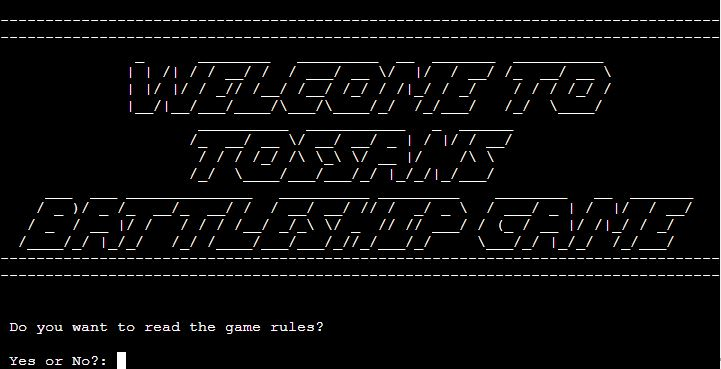
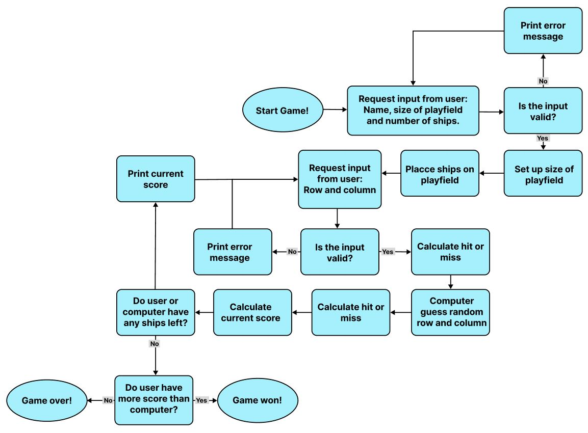
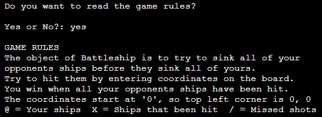
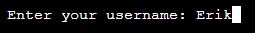

# TOSSANS BATTLESHIP GAME

Visit [Tossans battleship game](https://tossans-battleships-game-b3734a738de1.herokuapp.com/)

---

## CONTENTS 

---
## Intoduction
Tossans battleship game is a Python terminal game. It runs on a mock terminal deployed to Heroku. 

It is based on the classic board game “battleships”. A guessing game for two players that is played on ruled grids on which each player place their ships on. The locations of the ships are concealed for the other player. Players alternate turns calling "shots" at the other player's ships, and the objective of the game is to destroy the opposing player's fleet.

## The User Experience

### Site Purpose
* To offer a simple and fun game to the users.

### User Goals
As a user i want:

* To have fun while being challenged.

* To learn and understand the game.

* The game to offer replay value with alot of customizable options.

* To easily choose available options and have a clear response to my actions.

## Project Goals 
As the developer I want:

* Users to meet their goals above.

* The game to be functional and without errors.

## Design

### Flow Chart

[Figma](https://www.figma.com/) was used to plan the flow of the program.

### Titles and Headings
* All titles and headings was created with [Fancy Text](https://www.fancytextpro.com/BigTextGenerator).

---

## Features

### Welcome Page 

When the game is ran it immediately prints this welcome message and asks for input.

### Game Rules

Here the game asks if you want to read the game rules. If you enter "Yes" they will be printed out for you.

### Username

### Customizable Board

### Favicon

The page have a simple favicon of a blue flag

### Logo

### Features Left to Implement

### Accessibility

---

## Deployment & Local Development

### Deployment

The site is deployed using GitHub Pages. Visit the deployed site [here](https://tossan99.github.io/flag-quiz2/). To deploy using GitHub pages:

1. login or Sign Up to GitHub.
2. open the project repository.
3. Click on "Settings" on the navigation bar under the repository title.
4. Click on "Pages" in the left hand navigation panel.
5. Under "Source", choose which branch to deploy. This should be Main for newer repositories (older repositories may still use Master).
6. Choose which folder to deploy from, usually "/root".
7. Click "Save", then wait for it to be deployed. It can take some time for the page to be fully deployed.
8. Your URL will be displayed above "Source".

### Local Development

#### How to Fork

To fork the repository:

1. Log in (or sign up) to Github.
2. Go to the repository for this project, [Flag Quiz](https://github.com/Tossan99/flag-quiz2.git).
3. Click the Fork button in the top right corner.

#### How to Clone

To clone the repository:

1. Log in (or sign up) to GitHub.
2. Go to the repository for this project, [Flag Quiz](https://github.com/Tossan99/flag-quiz2.git).
3. Click on the code button, select whether you would like to clone with HTTPS, SSH or GitHub CLI and copy the link shown.
4. Open the terminal in your code editor and change the current working directory to the location you want to use for the cloned directory.
5. Type 'git clone' into the terminal and then paste the link you copied in step 3. Press enter.

---

## Testing

Go to this separate [testing page](#) to read about testing

### Validator testing

- Python3
  - All html pages have passed through the [Python3 validator]() 

### Unfixed Bugs

---

## Credits

### Code Used

### Content

### Media
