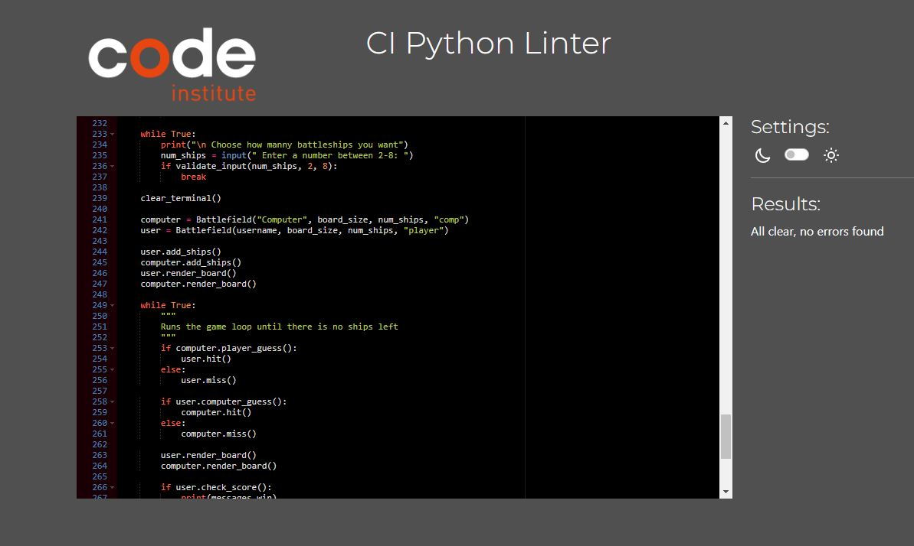
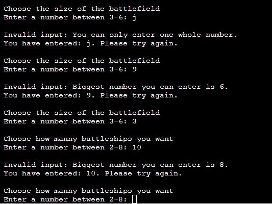

# TOSSANS BATTLESHIP GAME

Visit [Tossans battleship game](https://tossans-battleships-game-b3734a738de1.herokuapp.com/)

---

## Introduction
Tossans battleship game is a Python terminal game. It runs on a mock terminal deployed to Heroku. 

It is based on the classic board game “battleships”. A guessing game for two players that is played on ruled grids on which each player place their ships on. The locations of the ships are concealed for the other player. Players alternate turns calling "shots" at the other player's ships, and the objective of the game is to destroy the opposing player's fleet.

---

## The User Experience

### Site Purpose
* To offer a simple and fun game to the users.

### User Goals
As a user i want:

* To have fun while being challenged.

* To learn and understand the game.

* The game to offer replay value with alot of customizable options.

* To easily choose available options and have a clear response to my actions.

---

## Project Goals 
As the developer I want:

* Users to meet their goals above.

* The game to be functional and without errors.

---

## Design

### Flow Chart

* [Figma](https://www.figma.com/) was used to plan the flow of the program.

### Titles and Headings
* All titles and headings was created with [Fancy Text](https://www.fancytextpro.com/BigTextGenerator).

---

## Features

### Welcome Page 

When the game is ran it immediately displays this welcome message and asks for input.

### Game Rules

In this section the game asks if you want to read the game rules. If you enter "Yes" the rules will be display for you. 

This input is checked with a function that validates in the input. If the user give input that isn't asked for an error message will be printed.

### Username

In this section the game asks for a username. There are no validation checks for this input so the user can be as creative as they want.

### Customizable Board

In this section the game asks for input to set up the board. The user can choose to have a board from 3x3 to 6x6 and 2 to 8 battleships. 

This input is checked with a function that validates in the input. If the user give input that isn't asked for an error message will be printed.

### Battlefield

In this section the battlefield is displayed to the user. The board displays the users username, score, ships and misses/hits from the player and computer.

### Coordinates Input

In this section the game asks for the user to guess a coordinate to take a shot at the opponents board. This is done by entering a number for row and column. 

This input is checked with a function that validates in the input. If the user give input that isn't asked for an error message will be printed.

### Win and Lose

This section is displayed when all of someones ships have been hit.

### Replay

This section asks the user if they want to play again. If the user answers "Yes" the game will run again and if the user answers "no" it will exit the game and display the "Thank you for playing" message. 

This input is checked with a function that validates in the input. If the user give input that isn't asked for an error message will be printed.

### Features Left to Implement
* Different sizes for ships

At the moment all ships consists of 1x1 squares. I would like to fin a way to make ships 2x1, 3x1, 2x2 and so on...

* Highscore

I would like to link a google sheet to the game and store user data for a highscore page that can be viewed in the game

* Customizable option for both user and computer

In the games current state the user can only customize both boards at the same time. I would like to add the option to customize the boards individually.

---

## Bugs
* Points given to wrong player

The biggest and almost only bug i experienced was that points and hits was assigned to the wrong player. The solution was to call the functions from the opposite player class instance, return true/false and then call the function from the correct function from the player guessed the coordinates.

* clear_terminal() doesn't clear the whole terminal.

Couldnt find a solution to this bug

---

## Technologies Used
* Languages: 
    * Python.
* Libraries:
    * random 
        - Used to select a random word.
    * os
        - Used for its `clear` tool, to clear the terminal window.
* Others:
    * Github
        - To store the repository for submission.
    * Heroku
        - To deploy a live version of the terminal.
    * Lucid 
        - To make a flowchart for preparation to project.
    * Fancy text pro
        - To make word art. 

---

## Deployment

This program was deployed to [Heroku](https://heroku.com/). You can visit the live site [here](https://py-hangman-py.herokuapp.com/).

**To deploy a copy of this project for your self follow these steps:**
1. Fork or clone this repository.
2. Create a new app on Heroku.
3. Ensure that the buildpacks are set to `Python` and `NodeJS`.
4. Link the app on Heroku to the repository.

**Deployment:**
1. Once the Config Vars are set, click Deploy.
2. Scroll to the bottom of the deploy options and click the **Deploy Branch** button. Optionally you can also **Enable Automatic Deploys**.
3. The site will now be live.

---

## Testing

### Automated testing
I used Code Institutes own validator https://pep8ci.herokuapp.com/ to check the code and the code had no errors or warnings in it.

### Manual Testing

I been testing the code many times by my own in the local terminal and in the mock terminal on the deployed site Heroku.
- Tried to put invalid input.

- Navigated through the whole game while trying out diffrent of options.

---

## Credits

* I used wordart from [Fancy text pro](https://www.fancytextpro.com/BigTextGenerator?fbclid=IwAR0TsTKLRY91w8ggGxdgfZp6Cu-R4HP2SjAemqdaCRtT86b_tIwp-WeF3u8).
* I learned about how to clear the terminal window from Stack Overflows [thread](https://stackoverflow.com/questions/2084508/clear-terminal-in-python).
